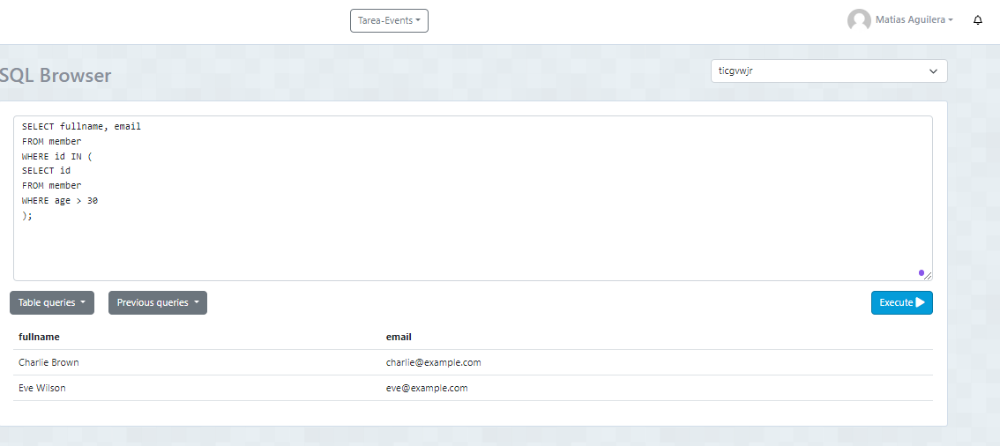

### Listar el nombre y el correo de los cleintes con edades mayores a 30 años

```
SELECT fullname, email
FROM member
WHERE id IN (
SELECT id
FROM member 
WHERE age > 30
);

```


### Listar la descripcion y la ciudad de los eventos con asistencias mayores a 150 personas

```
SELECT description, city
FROM event
WHERE id IN (
SELECT id
FROM event
WHERE total_attendees > 150
);

```
